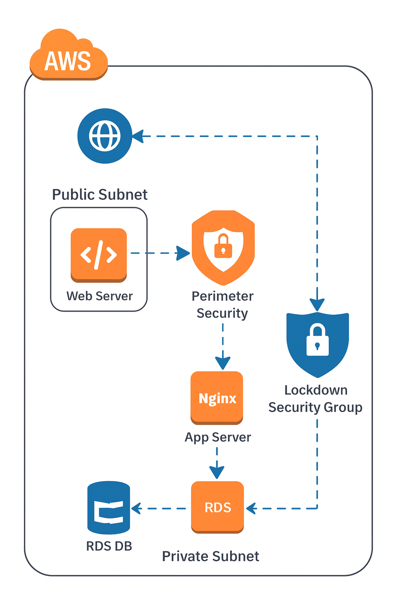

# 3-Tier AWS Architecture (Node.js + RDS) — Demo

This repository contains an **architecture diagram** and a **README** describing how to deploy a simple 3-tier architecture on AWS using the Console:
- **Web tier:** Public EC2 instance (`web-server`) running **Nginx** (reverse proxy + bastion)
- **App tier:** Private EC2 instance (`app-server`) running **Node.js** (Express) on port `3000`
- **DB tier:** Amazon **RDS (MySQL)** in private subnets, not publicly accessible

> This demo is designed for the AWS Free Tier (use `t2.micro`/`t3.micro` instances and the Free Tier RDS option where eligible).
---

## Architecture overview

1. **Internet** → **Web EC2 (public subnet)**
   - Nginx acts as a reverse proxy and can forward `/api` requests to the app server.
   - Web EC2 is also used as a bastion host to SSH into the private app server.
   - Security Group `SG-Web` allows SSH from your IP and HTTP (80) from the Internet.

2. **App EC2 (private subnet)**
   - Hosts the Node.js app (Express) listening on port `3000`.
   - No public IP; reachable only from `SG-Web` or an internal load balancer.
   - Security Group `SG-App` allows inbound `3000` from `SG-Web` only.

3. **RDS MySQL (private subnet)**
   - Database instance (MySQL) not publicly accessible.
   - Security Group `SG-DB` allows inbound `3306` only from `SG-App`.

---

## Quick deployment checklist (Console + SSH)

**VPC / Networking**
- Create VPC (`10.0.0.0/16`) with two public and two private subnets.
- Create Internet Gateway and route public subnets to it.
- (Optional) Create NAT Gateway in a public subnet if your private instances need outbound internet access.

**Security Groups**
- `SG-Web` — inbound: SSH (22) from your IP, HTTP (80) from 0.0.0.0/0
- `SG-App` — inbound: TCP 3000 from `SG-Web`, inbound: SSH (22) from SG-Web,
- `SG-DB` — inbound: MySQL 3306 from `SG-App`

**EC2 Instances**
1. Launch `web-server` in a **public subnet** with `SG-Web`, assign public IP. Install Nginx and use as reverse proxy + bastion.
2. Launch `app-server` in a **private subnet** with `SG-App`, no public IP. Install Node 18, deploy the Express app, and run it as a systemd service.

**RDS**
- Create MySQL RDS instance in private subnets, no public access, attach `SG-DB`. Note the endpoint.

**App configuration**
- Use environment variables (`DB_HOST`, `DB_USER`, `DB_PASS`, `DB_NAME`, `DB_PORT`) to configure DB connectivity.
- Create an `appuser` in MySQL and grant privileges to the application database.

## Included helper files

- `server.js` — sample Express app that connects to RDS (same as used on the app-server).
- `package.json` — Node dependencies and start script.
- `three-tier-app.service` — systemd unit for running the Node app as a service.

-----
[setup-steps](setup-steps.txt) 

-----

**Testing**
- From the web server: `curl http://<app-private-ip>:3000/db`
- From your laptop: `curl http://<web-public-ip>/db` (proxied through Nginx)

---

## Security & Cost cleanup

- Restrict SSH (22) to your IP only.
- Remove private keys from EC2 after use.
- Delete resources when finished: terminate EC2s, delete RDS (optionally skip final snapshot), delete NAT Gateway, release Elastic IPs, delete ALB / load balancer.
- Monitor the AWS Billing console regularly.

---